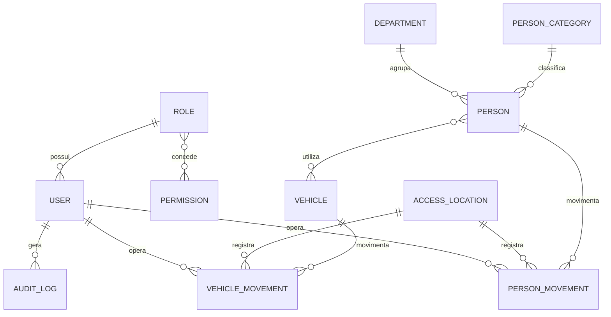

# Modelo de dados

Movimentações são append-only na interface. `uuid` é único e garante idempotência. Correções preservam o original por `corrects_id`, `status` e justificativa. Datas operacionais são armazenadas em UTC; a apresentação usa `America/Sao_Paulo`.
